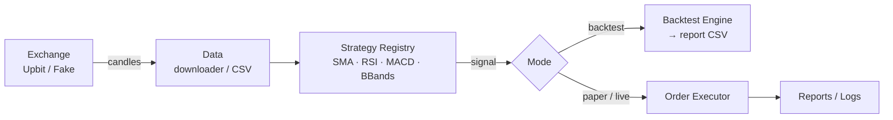

# AutoTrade

[](https://github.com/illbok/AutoTrade/actions/workflows/ci.yml)


**모듈형 암호화폐 자동매매 시스템.** 시세 수집 → 전략 판단 → 주문 실행 → 백테스트 리포트까지 하나의 CLI로 처리합니다. Upbit 공개 API를 사용하며, 실거래 없이 전체 파이프라인을 검증할 수 있도록 페이퍼 트레이딩과 FakeExchange를 기본 제공합니다.

> ⚠️ **Disclaimer**: 학습·연구 목적 프로젝트입니다. 실거래 손실에 대한 책임은 사용자에게 있습니다.

## ✨ 주요 기능

- **전략 플러그인 구조** — 데코레이터 기반 전략 레지스트리로 새 전략을 파일 하나 추가로 등록
  - 내장 전략: `SMA Cross` · `RSI` · `MACD` · `Bollinger Bands`
- **백테스팅 엔진** — 캔들 CSV 기반 백테스트 후 리포트 자동 생성
- **페이퍼/실거래 분리** — 기본값은 페이퍼 모드. 실거래는 설정 파일과 CLI 플래그가 모두 일치할 때만 활성화되는 2중 안전장치
- **거래소 추상화** — `IExchangeClient` 인터페이스 뒤에 `UpbitClient`/`FakeExchange`를 두어, 네트워크 없이도 전체 로직 테스트 가능
- **캔들 데이터 다운로더** — 중복 제거(dedup)와 이어쓰기(append)를 지원하는 CSV 수집기

## 🏗 아키텍처



전략은 레지스트리 패턴으로 관리됩니다. 새 전략은 `@register("이름")` 데코레이터만 붙이면 CLI(`autotrade strategies`)에 자동 노출됩니다.

## 🚀 시작하기

```bash
# 설치 (개발 도구 포함)
git clone https://github.com/illbok/AutoTrade.git
cd AutoTrade
pip install -e ".[dev]"
```

```bash
# 1) 캔들 데이터 수집 (Upbit 공개 API, 인증 불필요)
autotrade download --symbol KRW-BTC --interval 15m --limit 200 --out data/krw-btc-15m.csv

# 2) 사용 가능한 전략 확인
autotrade strategies

# 3) 백테스트 실행
autotrade bt --config configs/dev.yaml

# 4) 페이퍼 트레이딩 (기본값, 실주문 없음)
autotrade live --config configs/dev.yaml --loops 10 --sleep-s 5
```

실거래는 `configs/*.yaml`의 `live: true` 설정과 `--live 1` 플래그를 모두 의도적으로 켜야만 동작합니다.

## 📁 프로젝트 구조

```
src/autotrade/
├── cli.py            # Typer 기반 CLI 엔트리포인트
├── app.py / live.py  # 트레이딩 루프
├── exchanges/        # IExchangeClient 인터페이스 + Upbit/Fake 구현
├── data/             # 캔들 다운로더 (CSV, dedup/append)
├── strategies/       # 전략 레지스트리 + SMA/RSI/MACD/BBands
└── backtest/         # 백테스트 엔진
configs/              # 환경별 설정 (pydantic-settings + YAML)
tests/                # pytest 단위 테스트
.github/workflows/    # CI 파이프라인
```

## ✅ 코드 품질

CI에서 **Ubuntu / macOS / Windows × Python 3.10 / 3.11 / 3.12** 매트릭스로 다음을 검증합니다:

| 도구 | 역할 |
|---|---|
| `ruff` | 린트 / 코드 스타일 |
| `mypy` | 정적 타입 검사 (`src` 전체) |
| `pytest` + coverage | 단위 테스트 및 커버리지 리포트 |
| `black`, `pre-commit` | 포매팅, 커밋 훅 |

```bash
ruff check . && mypy src && pytest
```

## 💡 설계하면서 배운 점

- **인터페이스 분리의 가치** — 거래소를 `IExchangeClient`로 추상화하니 실제 API 없이 `FakeExchange`로 전략·백테스트 로직을 온전히 테스트할 수 있었습니다.
- **실거래 안전장치는 이중으로** — 설정 파일과 CLI 플래그를 모두 요구하도록 설계해, 실수로 실주문이 나가는 경로를 차단했습니다.
- **레지스트리 패턴** — 전략 추가 시 기존 코드를 수정하지 않는 개방-폐쇄 구조를 직접 구현해 봤습니다.

## 🗺 로드맵

- [ ] 전략 파라미터 최적화 (grid search)
- [ ] ML 기반 시그널 모델 실험 (가격 예측 → 전략 결합)
- [ ] 백테스트 결과 시각화 대시보드 (matplotlib → HTML 리포트)
